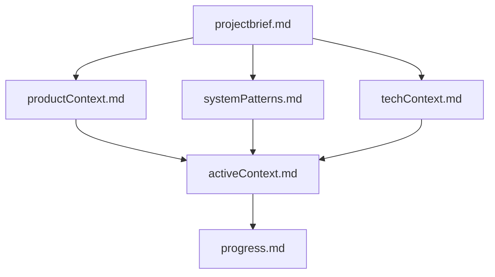
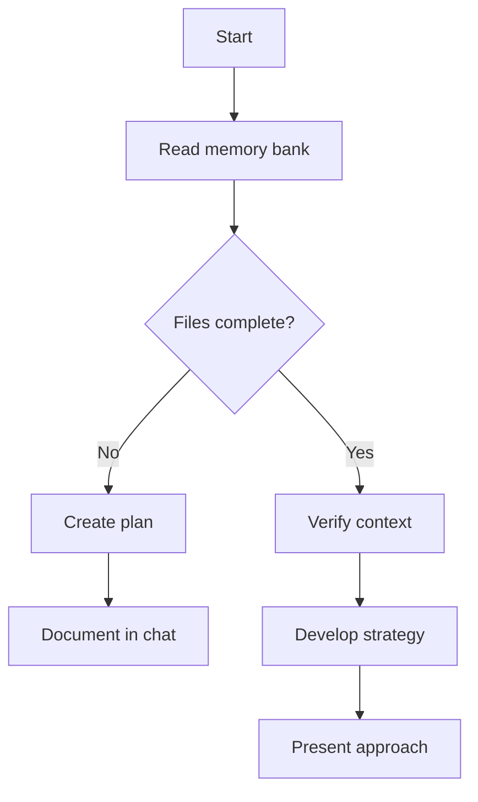
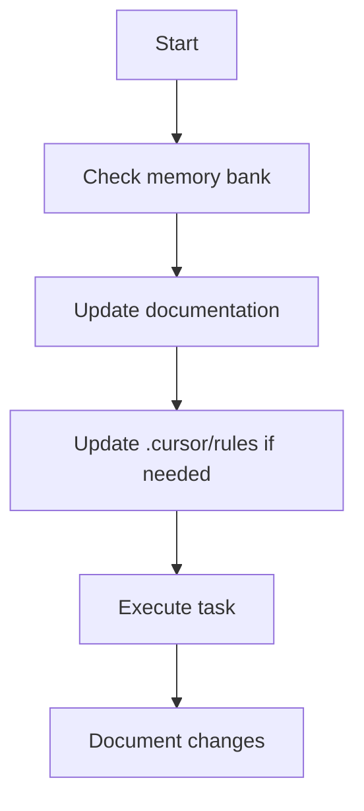
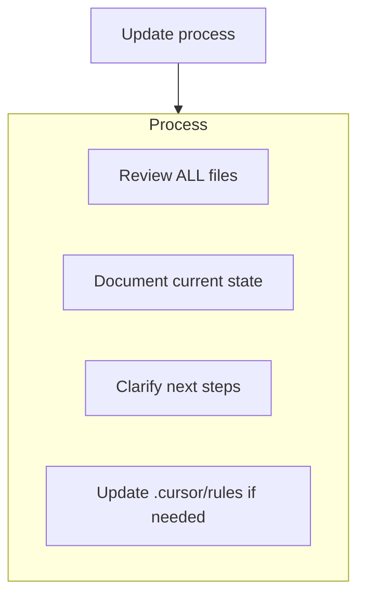
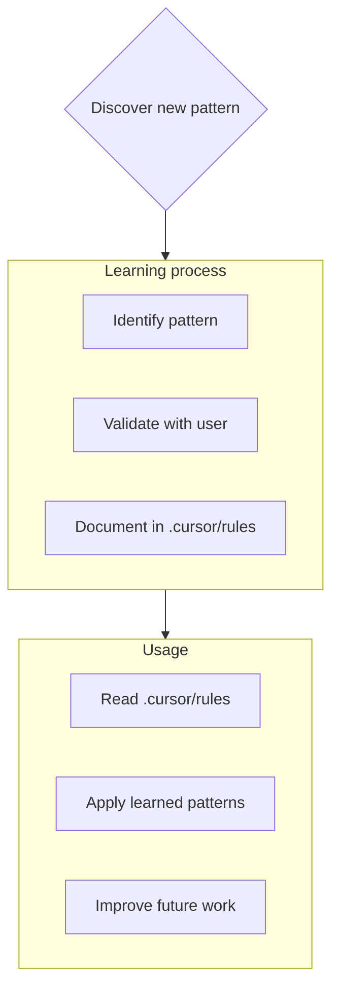

# Claude Code — project context

<!-- cloude-code-toolbox:mcp-skills-awareness-begin -->

### MCP & Skills awareness (Cloude Code ToolBox)

_Last synced: 2026-05-18T12:12:42.300Z._

- **Full report:** `.claude/cloude-code-toolbox-mcp-skills-awareness.md` in this workspace (auto-overwritten on each scan). Use it as ground truth for configured servers and skill folders.
- **MCP:** For **live tools** in Claude Code, enable the matching server via `/mcp`. Servers are configured in `~/.claude.json` (user) and `.mcp.json` (project).
- **When the user’s task matches a server** (e.g. Confluence work and a **Confluence** / **Atlassian** MCP is listed), **prefer that server id** and plan on tool use—not only file search.
- **Skills:** Folders below contain `SKILL.md`; attach or cite paths in chat when relevant.

#### Workspace MCP

- `d:\web development\My_Projects\Radom_call\random_video_call_backend\.mcp.json` _(workspace: random_video_call_backend)_ — _file missing_

_No active workspace servers in mcp.json._

#### User MCP

- `C:\Users\sujee\.claude.json` — _no servers defined_

_No active user-scoped servers in mcp.json._

#### Project skills

_None found (or no workspace open)._

#### User skills

_None found._

<!-- cloude-code-toolbox:mcp-skills-awareness-end -->
<!-- claude-code-memory-bank:begin -->
# Memory bank (persistent context)

This repository uses a **memory bank** under `./memory-bank/` — structured markdown that survives sessions, similar to Cursor-style workflows.

Context layers (read deeper files after foundations): **projectbrief** → **productContext** / **systemPatterns** / **techContext** → **activeContext** → **progress**.

## What Claude should do

1. **Before substantive work**, read **all** of the following under `./memory-bank/` when the task depends on project state (not optional for non-trivial work). In **Plan mode**, reading for the plan is allowed; **do not edit** these files until **Act mode** unless the user only asked for a documentation/memory update with no code change.
   - `projectbrief.md` — scope and goals
   - `productContext.md` — product intent and UX
   - `systemPatterns.md` — architecture and conventions
   - `techContext.md` — stack and constraints
   - `progress.md` — done / pending / known issues
   - `activeContext.md` — current task and decisions

2. **During Act-mode work**, keep `activeContext.md` aligned with the current task (update when focus shifts).

3. **After meaningful milestones** (in Act mode), update `progress.md` and any affected docs in `./memory-bank/`.

4. When the user asks to **update memory bank** (or similar), **open and review every** file in `./memory-bank/`, then update what changed — especially `activeContext.md` and `progress.md`, even if other files are unchanged. Prefer doing heavy memory-bank writes in **Act mode** unless the user asked for documentation-only updates.

5. Prefer **short, factual updates** over long prose. Reference files, symbols, and tickets instead of duplicating code.

Do not delete these files; evolve them as the project changes.
<!-- claude-code-memory-bank:end -->

<!-- cursor-rules-to-claude:always-begin -->
<!-- Generated by cursor-rules-to-claude — re-run after changing Cursor rules. -->

# Project instructions (from Cursor rules)

## .cursor/rules/core.mdc

<!-- Source: .cursor/rules/core.mdc -->
## Core rules — Plan / Act (match GitHub Copilot instructions)

You have two modes of operation:

1. **Plan mode** — Work with the user to define a plan; **do not change the codebase** until the user approves.
2. **Act mode** — Make changes based on the approved plan.

### Plan mode (default)

- **First line MUST be:** `# Mode: PLAN`
- **Do not** create, edit, or delete any files (including under the memory bank path), apply patches, or run terminal commands that modify the workspace—**only** read/search, discuss, and output the plan in markdown.
- Stay in Plan mode until the user explicitly approves (e.g. **`ACT`**).
- If the user asks for edits while in Plan mode, respond with `# Mode: PLAN`, remind them you need approval first, and ask them to type **`ACT`** when ready.
- In Plan mode, include the **full updated plan** in every response.
- End by telling the user to type **`ACT`** to implement (or refine the plan).

### Act mode

- **First line MUST be:** `# Mode: ACT`
- Enter only after clear approval (**`ACT`**, **"go ahead"**, **"implement the plan"**, or user explicitly skipped planning).
- Then you may edit files, run commands, and update documentation.
- After completing Act-mode work for that turn, the next user message starts in **Plan mode** again unless they send **`ACT`** for more edits.

### Exceptions

- If the user clearly says to **skip the plan** and implement immediately, you may use `# Mode: ACT` and proceed.

## .cursor/rules/memory-bank.mdc

<!-- Source: .cursor/rules/memory-bank.mdc -->
> Persistent project memory via markdown files (memory bank)

# Cursor memory bank

You are an AI assistant whose **session memory resets**. Treat the **memory bank** as the durable source of truth for project context. At the **start of every substantive task**, read **all** memory bank files under `./memory-bank/` — this is not optional when the task depends on project state.

## Memory bank structure

Core files (Markdown), in hierarchy order (all under `./memory-bank/`):

### Core files (required)

1. `./memory-bank/projectbrief.md` — Scope, goals, source of truth for what “done” means.
2. `./memory-bank/productContext.md` — Why the product exists, problems solved, UX goals.
3. `./memory-bank/activeContext.md` — Current focus, recent changes, next steps, active decisions.
4. `./memory-bank/systemPatterns.md` — Architecture, technical decisions, patterns, component relationships.
5. `./memory-bank/techContext.md` — Stack, setup, constraints, dependencies.
6. `./memory-bank/progress.md` — What works, what is left, status, known issues.

### Additional context

Add files or subfolders under `./memory-bank/` when useful (integrations, APIs, testing, deployment, etc.).

## Workflows

### Plan mode

### Act mode

## Documentation updates

Update the memory bank when:

1. You discover new project patterns.
2. You finish significant implementation work.
3. The user asks to **update memory bank** — then **review every** memory bank file (even if most need no edit). Pay extra attention to `activeContext.md` and `progress.md`.
4. Context is unclear and needs clarification.

## Project intelligence (`.cursor/rules`)

Use `.cursor/rules` as a **learning journal**: preferences, non-obvious patterns, tooling, and decisions that are not already captured in code or the memory bank.

### What to capture

- Critical implementation paths and conventions
- User preferences and workflow
- Project-specific patterns and pitfalls
- How decisions evolved

**Remember:** after a reset, the memory bank (and `.cursor/rules`) is your continuity. Keep them accurate and concise.
<!-- cursor-rules-to-claude:always-end -->
